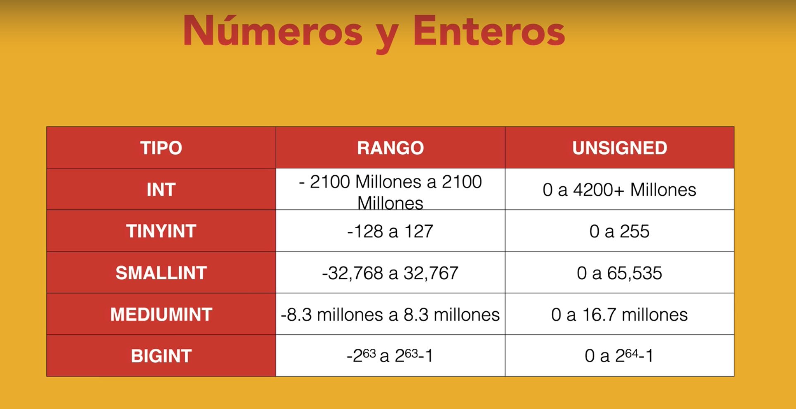
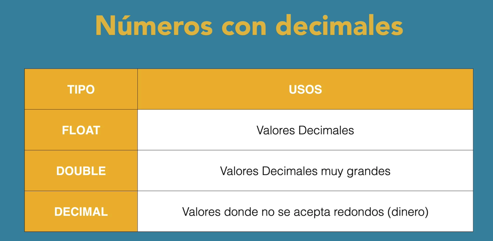
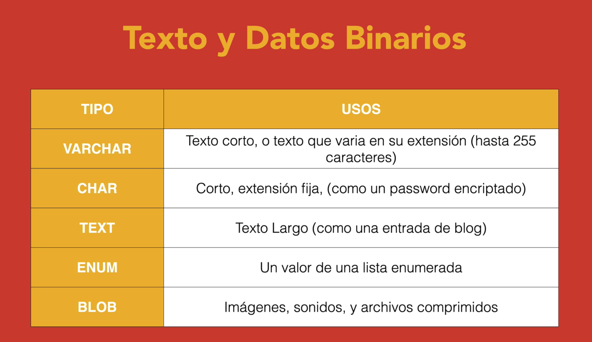
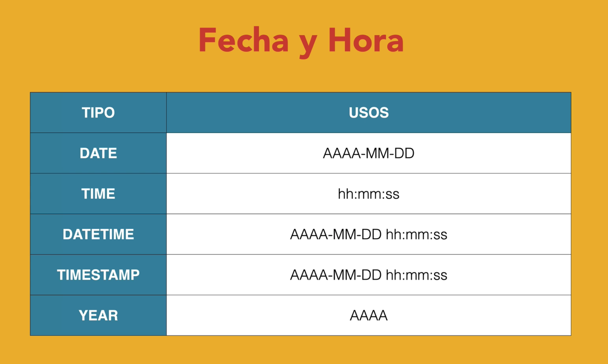
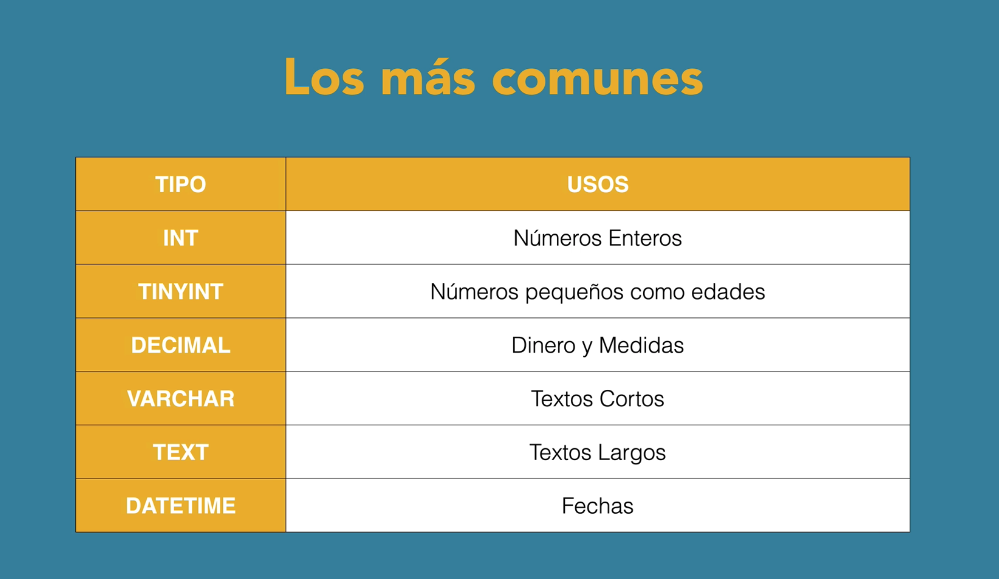

# Video #230 - Seccion #20

## Crear una tabla

```sql
CREATE TABLE servicios(
    -> id INT(11) NOT NULL AUTO_INCREMENT,
    -> nombre VARCHAR(60) NOT NULL,
    -> precio DECIMAL(5,2) NOT NULL,
    -> PRIMARY KEY (id)
    -> );
```

## Tipos de datos

### Numericos





### Texto y Binarios



### Fecha y Hora



### Mas comunes


