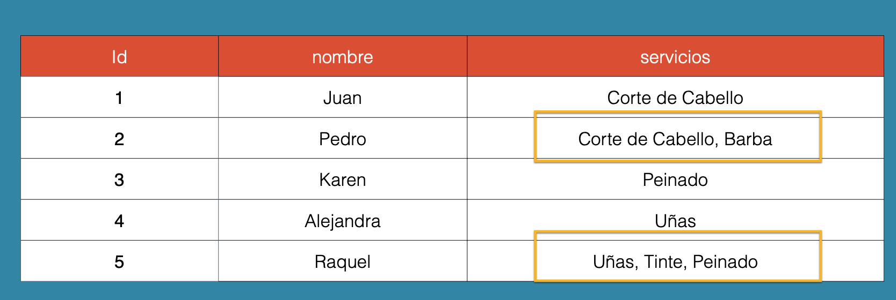
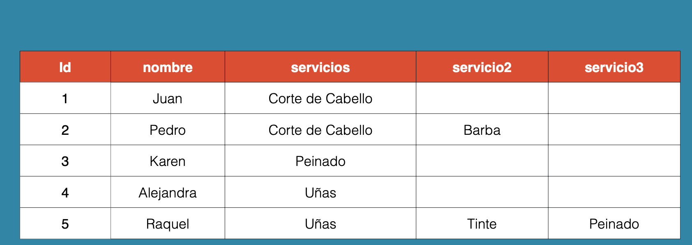
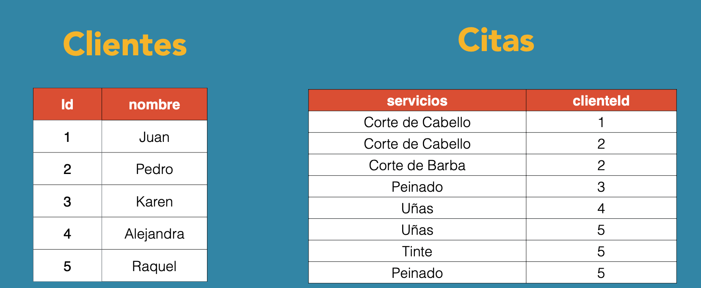
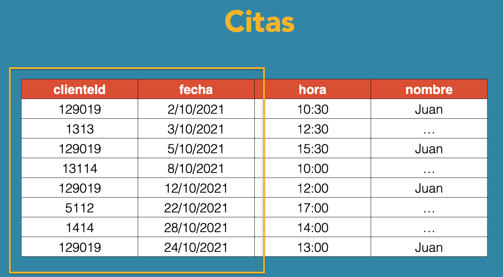
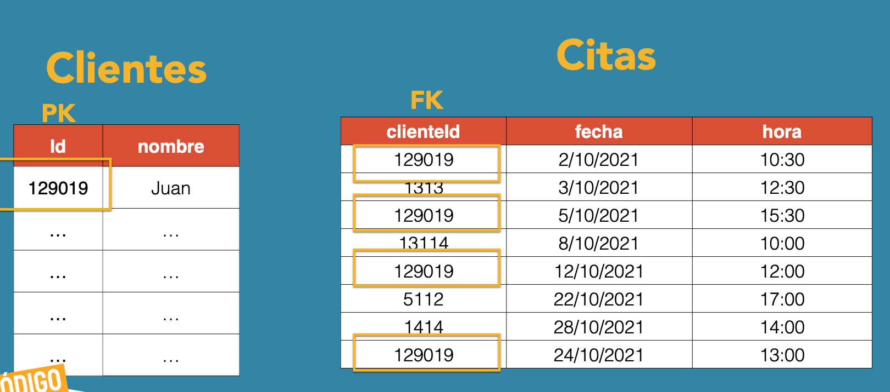
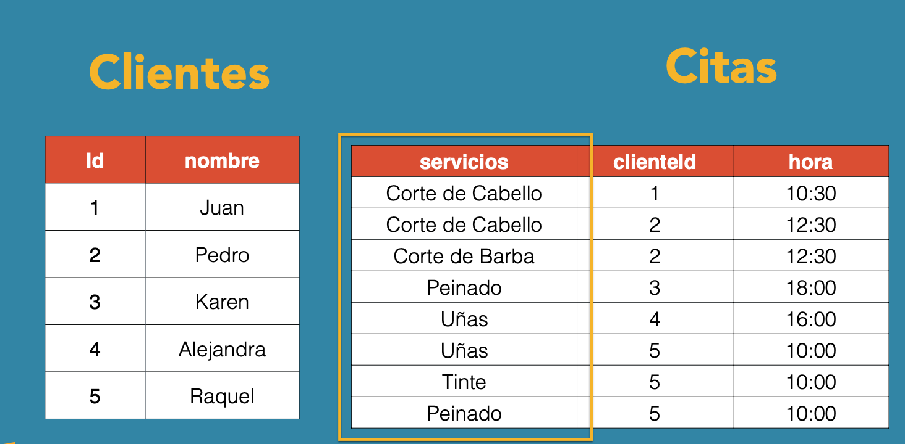
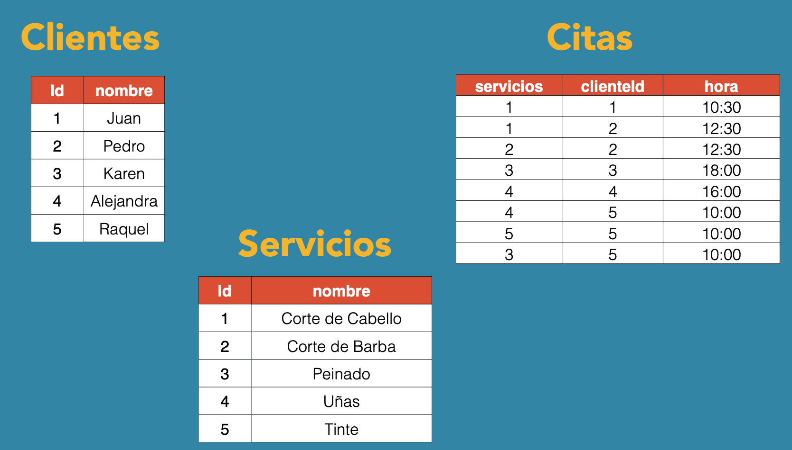
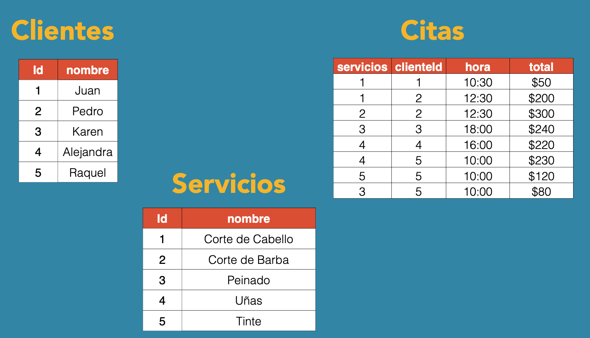

# Reglas de normalizacion

## Primera regla de normalizacion

```markdown
- Elimina grupos repetidos en tablas individuales
- Crea distintas tablas para cada conjunto de datos
- Identifica cada conjunto de datos relacionados con una llave primaria (PK)
```





## Segunda regla de normalizacion

```markdown
- Crea tablas separadas para conjuntos de valores que apliquen a multiples registros
- Relaciona las tablas con una llave externa (FK)
```




## Tercera regla de normalizacion

```markdown
- Eliminar (separar) los datos que no dependen de la llaver
```




