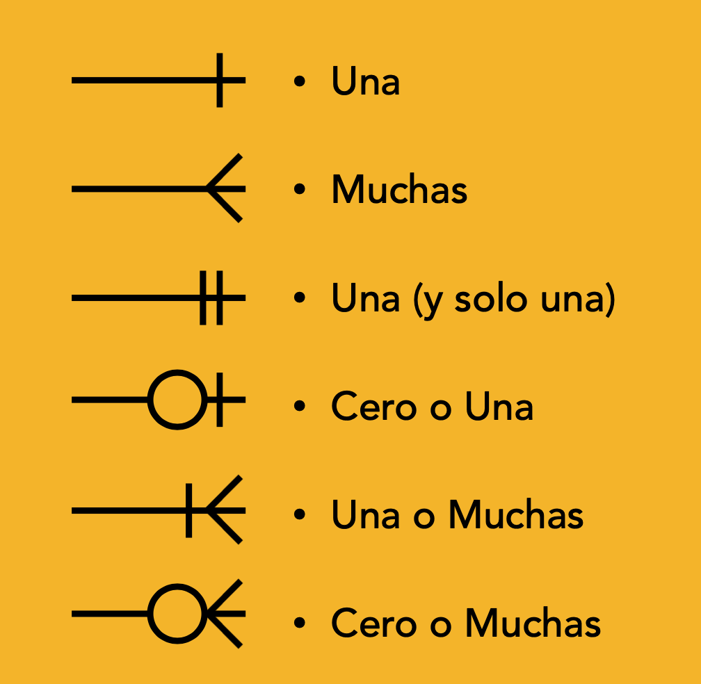
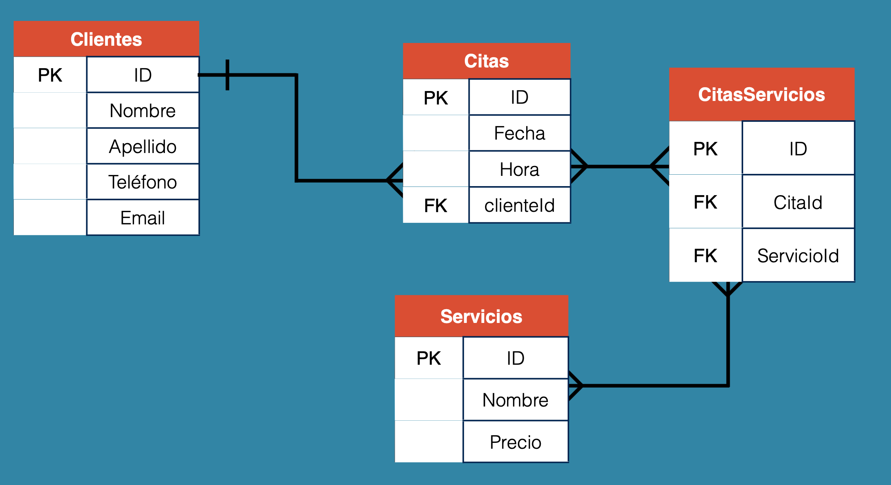

# Video #247 - Seccion #22

## Cardinalidad y Diagramas Entidad Relacion (ER




## Comandos usados

```sql
DROP TABLE reservaciones;
```

```sql
CREATE TABLE clientes{
    id INT(11) NOT NULL AUTO_INCREMENT,
    nombre VARCHAR(60) NOT NULL,
    apellido VARCHAR(60) NOT NULL,
    telefono VARCHAR(10) NOT NULL,
    email VARCHAR(30) NOT NULL UNIQUE,
    PRIMARY KEY(id)
    };
```

```sql
INSERT INTO clientes (nombre, apellido, telefono, email) VALUES
    ("Carlos", "Calderon", "9999825120", 'correoejemplo@personal.com');
```
